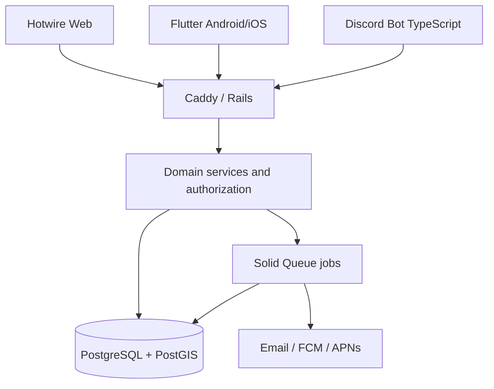

# System Architecture
## Chosen approach
Modular monolith: existing Rails 8/Hotwire application remains the only authority for identity, players, courts, matches, ratings, messages, and permissions. Flutter mobile and TypeScript discord.js bot are clients of versioned Rails REST APIs. Solid Queue handles async jobs; PostgreSQL/PostGIS stores durable state. Caddy terminates HTTPS.

## Design rules
- Controllers orchestrate; domain services own state transitions; policies authorize.
- No direct database access from Flutter or Discord.
- REST v1 with stable JSON schema and structured errors; publish OpenAPI spec.
- Preserve GetCourt behavior where possible; refactor only to support explicit shared business rules.
- Keep app modular; no Kubernetes, event bus, Redis, or microservices unless measured needs justify them.
- Prefer a repo layout that minimizes upstream merge pain. Do not move the Rails root in Phase 0.

## Alternative approaches considered
1. **Selected** Rails modular monolith + Flutter + thin Discord bot: low operational burden and reuse.
2. Rewrite backend in Node/Go: unified language potential but unnecessary regression/migration cost.
3. Split services early: stronger isolation but significant operational overhead at 100–500 users.

## Risks
Authentication bypass in upstream session logic; SQLite-specific migrations; Ruby native dependency ARM64 support; upstream updates; location privacy; score confirmation races; bot permissions.
